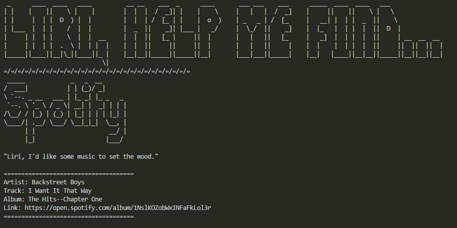

# liri-node-app

https://allenjwelch.github.io/liri-node-app/

### Node Application _(must be run within terminal/bash)_
User type can input the following terminal commands to access various APIs. 
1. `node liri.js my-tweets`
  - Access the last 20 favorite tweets from user account
2. `node liri.js spotify-this-song '<song name here>'`
  - Search for songs using the Spotify API
  - If no song is given, default searches for "The Sign" by Ace of Base
3. `node liri.js movie-this '<movie name here>'`
  - Search for movies using the OMDB API
  - If no movie is given, default searches for "Mr. Nobody" 
4. `node liri.js do-what-it-says`
  - Liri reads from the random.txt file for command and search (if applicable)
5. `node liri.js help`
  - In case user forgets the aboce commands, the 4 commands will be displayed for the user to select from the list
  - If user selects 'spotify-this-song' or 'movie-this' commands, the user will then be prompted to type in what they are searching for

### To Do...
* In addition to logging the data to the terminal/bash window, output the data to a .txt file called `log.txt`